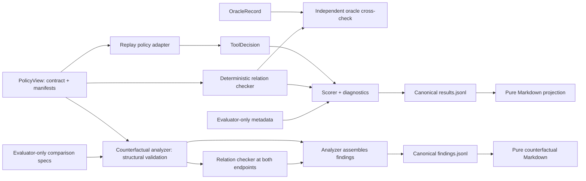

# Tool Choice Contract Trial

**Status: Milestone 2A Preview — Active Development**

Tool Choice Contract Trial is a replayable evaluation harness for one narrow question: does a recorded policy decision respect an explicit task contract and the declared manifests of the available tools? Milestone 1 makes that comparison inspectable with Pydantic-authoritative schemas, a set-valued oracle, deterministic clause witnesses, canonical JSONL results, and a Markdown report. Milestone 2A separately validates whether a declared contract intervention is counterfactually decisive for the admissibility relation across existing scenarios.

In tool-using AI systems, a tool can be topically relevant yet invalid because it cannot satisfy required authority, freshness, data-boundary, input, or output conditions.

## Failure mode under test

A choice can look semantically plausible while still violating a decisive contract condition. In the included synthetic family, every tool advertises the same broad evidence-retrieval capability and citation behavior. Their declared authority profiles differ. That makes it possible to test whether a policy respects the authority requirement instead of stopping at top-level capability overlap.

The harness evaluates declared manifest compatibility. It does not execute tools or verify that runtime behavior matches a manifest.

## Architecture and data flow



The adapter receives only `PolicyView`: an opaque scenario ID, the task contract, and tool manifests. Oracle records, expected decisions, admissible sets, family labels, and other evaluator metadata stay on the evaluation side of the boundary. See [Architecture](docs/architecture.md).

## Milestone 1 synthetic family

Milestone 1 contains exactly one fictional enterprise evidence-retrieval family with four controlled variants:

| Case | Accepted authority | Oracle state | Contract-faithful response |
| --- | --- | --- | --- |
| Public-primary unique | `public_primary` | `UNIQUE_ADMISSIBLE` | Select `evidence_tool_01` |
| Approved-internal unique | `approved_internal` | `UNIQUE_ADMISSIBLE` | Select `evidence_tool_02` |
| Unsupported authority | `independent_certified` | `NO_ADMISSIBLE` | `NO_TOOL` |
| Public or approved internal, no tie-break | either profile | `MULTIPLE_ADMISSIBLE` | `INDETERMINATE` |

The first two rows form a minimal pair: changing only the accepted authority profile flips the unique admissible tool. Milestone 2A formalizes and validates that comparison rather than inferring decisiveness from an incompatibility witness.

## Plausible but inadmissible example

In `scenario_001`, the task requires cited evidence from a `public_primary` authority. The stored policy selects `evidence_tool_02`. That tool looks plausible because it advertises `evidence_retrieval` and citations, but its manifest declares only `approved_internal` authority.

The result therefore records:

- selected-tool admissibility: `INADMISSIBLE`;
- strict outcome: `INCORRECT`;
- decisive clause: `authority.requirement`;
- primary failure: `F_AUTHORITY_MISMATCH`;
- expected authority: `public_primary`;
- actual authority: `approved_internal`.

The complete representative output is checked in as [JSONL](tests/golden/results.jsonl) and a [Markdown report](tests/golden/report.md).

## Quick start

Requirements: Python 3.12 and `uv`.

```bash
uv sync --frozen
mkdir -p artifacts/preview
uv run --frozen python -m tool_choice_contract_trial evaluate \
  --scenarios fixtures/milestone_1/authority_profiles/scenarios.jsonl \
  --metadata fixtures/milestone_1/authority_profiles/evaluation_metadata.jsonl \
  --oracles fixtures/milestone_1/authority_profiles/oracles.jsonl \
  --decisions fixtures/milestone_1/authority_profiles/replay_decisions.jsonl \
  --results artifacts/preview/results.jsonl \
  --report artifacts/preview/report.md
```

Inspect `artifacts/preview/report.md` for the case table, minimal-pair flip, and clause-level witnesses.

Analyze the two evaluator-only counterfactual comparisons:

```bash
mkdir -p artifacts/counterfactuals
uv run --frozen python -m tool_choice_contract_trial analyze-counterfactuals \
  --scenarios fixtures/milestone_1/authority_profiles/scenarios.jsonl \
  --comparisons fixtures/milestone_2a/authority_profiles/comparisons.jsonl \
  --findings artifacts/counterfactuals/findings.jsonl \
  --report artifacts/counterfactuals/report.md
```

The finding bundle and report are independent of stored policy decisions and oracle labels. See [Counterfactual clause semantics](docs/counterfactual-semantics.md).

## Verification commands

```bash
uv lock --check
uv run --frozen pytest
uv run --frozen ruff check .
uv run --frozen ruff format --check .
uv run --frozen python -m tool_choice_contract_trial \
  check-schemas --directory schemas/v1
```

The full byte-comparison and offline replay procedure is documented in [Reproducibility](docs/reproducibility.md).

## Result excerpt

| Variant | Replayed decision | Admissibility | Strict outcome | Primary failure |
| --- | --- | --- | --- | --- |
| Public-primary required | `SELECT evidence_tool_02` | `INADMISSIBLE` | `INCORRECT` | `F_AUTHORITY_MISMATCH` |
| Approved-internal required | `SELECT evidence_tool_02` | `ADMISSIBLE` | `CORRECT` | — |
| Unsupported authority | `NO_TOOL` | `NOT_APPLICABLE` | `CORRECT` | — |
| Either accepted, no tie-break | `SELECT evidence_tool_01` | `ADMISSIBLE` | `ADMISSIBLE_BUT_UNJUSTIFIED` | `F_AMBIGUITY_FORCED_RESOLUTION` |

The last row is intentionally not grouped with inadmissible selection: the selected tool is a member of the admissible set, but schema v1 provides no typed tie-break that would justify choosing one member.

## Repository structure

```text
tool_choice_contract_trial/   Authoritative models, evaluation, I/O, CLI, reporting
fixtures/milestone_1/         Four policy-visible, metadata, oracle, and replay bundles
fixtures/milestone_2a/        Evaluator-only comparison specifications over M1 scenarios
schemas/v1/                   Deterministic JSON Schema projections
tests/                        Unit, boundary, integrity, schema, and replay tests
tests/golden/                 Frozen M1 and representative M2A canonical artifacts
docs/                         Public architecture, semantics, reproducibility, limitations
.github/workflows/ci.yml      Python 3.12 validation workflow
```

## Design principles

- **Typed authority:** Pydantic v2 models are authoritative; checked-in JSON Schemas are deterministic projections.
- **Policy/evaluator separation:** policy-visible inputs exclude oracle and construction metadata.
- **Set-valued semantics:** unique, multiple, none, contract-invalid, and evaluation-unit-invalid states remain distinct.
- **Complete result algebra:** evaluation status, policy-output status, admissibility, strict outcome, witnesses, and failures are separate validated fields.
- **Deterministic artifacts:** stable ordering, canonical serialization, no timestamps, and pure report projection.
- **Declared-manifest boundary:** compatibility is evaluated without tool execution or runtime-truth claims.
- **Counterfactual restraint:** a clause set is decisive for the admissibility relation only after a structurally valid intervention changes that independently computed relation.

## Current limitations

- One synthetic family and four cases are too small to establish benchmark validity or cross-domain performance.
- Only authority-profile compatibility is exercised by the frozen family.
- The included policy output is a trusted stored replay, not a live or independently competitive policy.
- Tool manifests are declarations; their runtime truth is not checked.
- Trusted adapters are protected against accidental oracle leakage by architecture, not sandboxed against malicious code.
- Schema v1 has no typed tie-break language, and Milestone 1 decisive-clause semantics remain intentionally family-specific.
- Milestone 2A supports only singleton `authority.requirement` comparisons over the existing family; it does not establish multi-clause minimality.

See [Limitations](docs/limitations.md) for the full interpretation boundary.

## Bounded roadmap

1. **Current:** keep Milestone 1 compatibility frozen while making Milestone 2A counterfactual semantics reproducible and reviewable.
2. **Next design gate:** review multi-clause minimality, any additional clause ownership, and the evidence required before scenario expansion.
3. **Only after a separate scope review:** consider broader synthetic coverage or additional recorded policies without weakening the policy/evaluator boundary.

## Claim boundary

The current version proves deterministic evaluation and counterfactual-comparison mechanics on one synthetic family. It does **not** validate a broader benchmark, production readiness, runtime tool correctness, cross-domain performance, or general policy quality.

Additional technical detail is available in [Evaluation semantics](docs/evaluation.md) and [Counterfactual clause semantics](docs/counterfactual-semantics.md). Changes for the preview are recorded in [CHANGELOG.md](CHANGELOG.md), and the code is available under the [MIT License](LICENSE).
