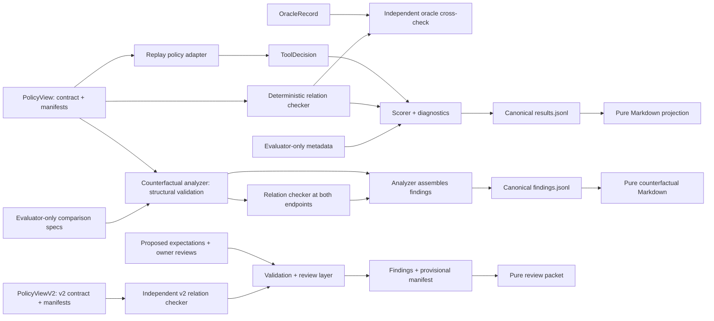

# Tool Choice Contract Trial

**Status: Milestone 2B Review Candidate — Active Development**

Tool Choice Contract Trial is a replayable evaluation harness for one narrow question: does a recorded policy decision respect an explicit task contract and the declared manifests of the available tools? Milestone 1 makes that comparison inspectable; Milestone 2A separately validates declared counterfactual interventions over its frozen authority family. Milestone 2B adds an isolated v2.1 review candidate for input, output/evidence, explicit-prohibition, and required-tool clauses, with proposed human-authored expectations cross-checked against an independent deterministic relation computation.

In tool-using AI systems, a tool can be topically relevant yet invalid because it cannot satisfy required authority, freshness, data-boundary, input, or output conditions.

## Failure mode under test

A choice can look semantically plausible while still violating a decisive contract condition. In the included synthetic family, every tool advertises the same broad evidence-retrieval capability and citation behavior. Their declared authority profiles differ. That makes it possible to test whether a policy respects the authority requirement instead of stopping at top-level capability overlap.

The harness evaluates declared manifest compatibility. It does not execute tools or verify that runtime behavior matches a manifest.

## Architecture and data flow



The v1 adapter and v2 relation checker receive only their policy-visible views: an opaque scenario ID, a task contract, and tool manifests. Oracle records, proposed expectations, review records, family labels, and other evaluator metadata stay on the evaluation side of the boundary. Milestone 2B loads no policy decisions. See [Architecture](docs/architecture.md).

## Milestone 1 synthetic family

Milestone 1 contains exactly one fictional enterprise evidence-retrieval family with four controlled variants:

| Case | Accepted authority | Oracle state | Contract-faithful response |
| --- | --- | --- | --- |
| Public-primary unique | `public_primary` | `UNIQUE_ADMISSIBLE` | Select `evidence_tool_01` |
| Approved-internal unique | `approved_internal` | `UNIQUE_ADMISSIBLE` | Select `evidence_tool_02` |
| Unsupported authority | `independent_certified` | `NO_ADMISSIBLE` | `NO_TOOL` |
| Public or approved internal, no tie-break | either profile | `MULTIPLE_ADMISSIBLE` | `INDETERMINATE` |

The first two rows form a minimal pair: changing only the accepted authority profile flips the unique admissible tool. Milestone 2A formalizes and validates that comparison rather than inferring decisiveness from an incompatibility witness.

## Plausible but inadmissible example

In `scenario_001`, the task requires cited evidence from a `public_primary` authority. The stored policy selects `evidence_tool_02`. That tool looks plausible because it advertises `evidence_retrieval` and citations, but its manifest declares only `approved_internal` authority.

The result therefore records:

- selected-tool admissibility: `INADMISSIBLE`;
- strict outcome: `INCORRECT`;
- decisive clause: `authority.requirement`;
- primary failure: `F_AUTHORITY_MISMATCH`;
- expected authority: `public_primary`;
- actual authority: `approved_internal`.

The complete representative output is checked in as [JSONL](tests/golden/results.jsonl) and a [Markdown report](tests/golden/report.md).

## Quick start

Requirements: Python 3.12 and `uv`.

```bash
uv sync --frozen
mkdir -p artifacts/preview
uv run --frozen python -m tool_choice_contract_trial evaluate \
  --scenarios fixtures/milestone_1/authority_profiles/scenarios.jsonl \
  --metadata fixtures/milestone_1/authority_profiles/evaluation_metadata.jsonl \
  --oracles fixtures/milestone_1/authority_profiles/oracles.jsonl \
  --decisions fixtures/milestone_1/authority_profiles/replay_decisions.jsonl \
  --results artifacts/preview/results.jsonl \
  --report artifacts/preview/report.md
```

Inspect `artifacts/preview/report.md` for the case table, minimal-pair flip, and clause-level witnesses.

Analyze the two evaluator-only counterfactual comparisons:

```bash
mkdir -p artifacts/counterfactuals
uv run --frozen python -m tool_choice_contract_trial analyze-counterfactuals \
  --scenarios fixtures/milestone_1/authority_profiles/scenarios.jsonl \
  --comparisons fixtures/milestone_2a/authority_profiles/comparisons.jsonl \
  --findings artifacts/counterfactuals/findings.jsonl \
  --report artifacts/counterfactuals/report.md
```

The finding bundle and report are independent of stored policy decisions and oracle labels. See [Counterfactual clause semantics](docs/counterfactual-semantics.md).

Build the Milestone 2B review packet:

```bash
mkdir -p artifacts/oracle_review
uv run --frozen python -m tool_choice_contract_trial validate-oracle-candidates \
  --scenarios fixtures/milestone_2b/review_candidate/scenarios.jsonl \
  --expectations fixtures/milestone_2b/review_candidate/oracle_expectations.jsonl \
  --reviews fixtures/milestone_2b/review_candidate/oracle_reviews.jsonl \
  --findings artifacts/oracle_review/oracle_validation_findings.jsonl \
  --report artifacts/oracle_review/oracle_review_packet.md \
  --manifest artifacts/oracle_review/provisional_bundle_manifest.json \
  --invalid-unit-register artifacts/oracle_review/invalid_unit_register.jsonl
```

Owner review is complete for all 12 current candidates, and all 12 proposals were accepted. The disputed original `v2_scenario_012` was replaced, rather than adjudicated in place, with an explicit required-and-forbidden-tool contradiction; the owner approved that replacement. Independent review has not been performed, no policy decisions are evaluated, and the v2.1 bundle remains an unfrozen `PROVISIONAL_REVIEW_CANDIDATE`. See [Oracle review candidates](docs/oracle-review-candidates.md).

## Verification commands

```bash
uv lock --check
uv run --frozen pytest
uv run --frozen ruff check .
uv run --frozen ruff format --check .
uv run --frozen python -m tool_choice_contract_trial \
  check-schemas --directory schemas/v1
uv run --frozen python -m tool_choice_contract_trial \
  check-schemas-v2 --directory schemas/v2
```

The full byte-comparison and offline replay procedure is documented in [Reproducibility](docs/reproducibility.md).

## Result excerpt

| Variant | Replayed decision | Admissibility | Strict outcome | Primary failure |
| --- | --- | --- | --- | --- |
| Public-primary required | `SELECT evidence_tool_02` | `INADMISSIBLE` | `INCORRECT` | `F_AUTHORITY_MISMATCH` |
| Approved-internal required | `SELECT evidence_tool_02` | `ADMISSIBLE` | `CORRECT` | — |
| Unsupported authority | `NO_TOOL` | `NOT_APPLICABLE` | `CORRECT` | — |
| Either accepted, no tie-break | `SELECT evidence_tool_01` | `ADMISSIBLE` | `ADMISSIBLE_BUT_UNJUSTIFIED` | `F_AMBIGUITY_FORCED_RESOLUTION` |

The last row is intentionally not grouped with inadmissible selection: the selected tool is a member of the admissible set, but schema v1 provides no typed tie-break that would justify choosing one member.

## Repository structure

```text
tool_choice_contract_trial/   Authoritative models, evaluation, I/O, CLI, reporting
fixtures/milestone_1/         Four policy-visible, metadata, oracle, and replay bundles
fixtures/milestone_2a/        Evaluator-only comparison specifications over M1 scenarios
fixtures/milestone_2b/        Twelve v2 scenarios, proposals, and owner-review records
schemas/v1/                   Frozen v1 deterministic JSON Schema projections
schemas/v2/                   Isolated v2 deterministic JSON Schema projections
tests/                        Unit, boundary, integrity, schema, and replay tests
tests/golden/                 Frozen M1/M2A and provisional M2B canonical artifacts
docs/                         Public architecture, semantics, reproducibility, limitations
.github/workflows/ci.yml      Python 3.12 validation workflow
```

## Design principles

- **Typed authority:** Pydantic v2 models are authoritative; checked-in JSON Schemas are deterministic projections.
- **Policy/evaluator separation:** policy-visible inputs exclude oracle and construction metadata.
- **Set-valued semantics:** unique, multiple, none, contract-invalid, and evaluation-unit-invalid states remain distinct.
- **Complete result algebra:** evaluation status, policy-output status, admissibility, strict outcome, witnesses, and failures are separate validated fields.
- **Deterministic artifacts:** stable ordering, canonical serialization, no timestamps, and pure report projection.
- **Declared-manifest boundary:** compatibility is evaluated without tool execution or runtime-truth claims.
- **Counterfactual restraint:** a clause set is decisive for the admissibility relation only after a structurally valid intervention changes that independently computed relation.
- **Reviewable oracle authoring:** proposed expectations, computed relations, independent reviews, and adjudication remain separate artifacts.
- **Versioned compatibility:** frozen v1 behavior and artifacts are not silently changed by v2 clause expansion.

## Current limitations

- The frozen v1 evaluation covers one synthetic family and four cases; the v2 layer adds three proposed synthetic families and 12 review-candidate cases. Neither establishes benchmark validity or cross-domain performance.
- V2 cases exercise only input profiles, output/evidence profiles, explicit prohibition, one required-tool identity field, and the compatible v1 capability/authority semantics.
- The included policy output is a trusted stored replay, not a live or independently competitive policy.
- Tool manifests are declarations; their runtime truth is not checked.
- Trusted adapters are protected against accidental oracle leakage by architecture, not sandboxed against malicious code.
- Schema v1 has no typed tie-break language, and Milestone 1 decisive-clause semantics remain intentionally family-specific.
- Milestone 2A supports only singleton `authority.requirement` comparisons over the existing family; it does not establish multi-clause minimality.
- Milestone 2B has 12 owner agreements; it has not been independently reviewed or frozen, and no policy decisions are evaluated against it.
- The v2 controlled pairs have not been processed by the v1-only Milestone 2A counterfactual analyzer.

See [Limitations](docs/limitations.md) for the full interpretation boundary.

## Bounded roadmap

1. **Current:** preserve frozen Milestone 1 and 2A artifacts while presenting the completed owner review of the v2.1 candidate.
2. **Next design gate:** obtain independent human review, adjudicate any resulting disagreement, and decide whether the candidate is suitable to freeze.
3. **Only after a separate scope review:** consider v2 counterfactual analysis, policy comparison, or broader synthetic coverage without weakening the policy/evaluator boundary.

## Claim boundary

The current version proves frozen v1 evaluation and counterfactual-comparison mechanics on one synthetic authority family, plus deterministic v2 oracle-authoring and review mechanics on three proposed synthetic families. It does **not** establish independently reviewed v2 oracle truth, a frozen or broader benchmark, policy-comparison results, production readiness, runtime tool correctness, cross-domain performance, or general policy quality.

Additional technical detail is available in [Evaluation semantics](docs/evaluation.md), [Counterfactual clause semantics](docs/counterfactual-semantics.md), and [Oracle review candidates](docs/oracle-review-candidates.md). Changes for the preview are recorded in [CHANGELOG.md](CHANGELOG.md), and the code is available under the [MIT License](LICENSE).
